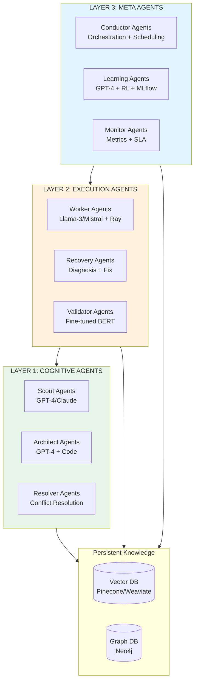

# Overview

## Three Layers. Dozens of Agents. One Compound Intelligence.

Sensei organizes its AI agents into three hierarchical layers, each with distinct responsibilities, model requirements, and learning horizons.

---

### The Three-Layer Agent Hierarchy



**Text representation:**

```text
┌─────────────────────────────────────────────────────────────┐
│                    LAYER 3: META AGENTS                     │
│              (The Evolvers — GPT-4 + RL + MLflow)           │
│   Conductor · Learning · Monitor                            │
│   Orchestrate · Extract patterns · Track health             │
├─────────────────────────────────────────────────────────────┤
│                  LAYER 2: EXECUTION AGENTS                  │
│           (The Doers — Llama-3/Mistral + Ray)               │
│   Worker · Recovery · Validator                             │
│   Execute tasks · Recover errors · Validate data            │
├─────────────────────────────────────────────────────────────┤
│                  LAYER 1: COGNITIVE AGENTS                  │
│          (The Thinkers — GPT-4/Claude + LangChain)          │
│   Scout · Architect · Resolver                              │
│   Understand schemas · Plan strategies · Resolve conflicts  │
└─────────────────────────────────────────────────────────────┘
              ↑                                    ↑
         Vector Memory                       Graph Knowledge
        (Pinecone/Weaviate)                    (Neo4j)
```

---

### Layer 1: Cognitive Agents

Cognitive Agents are the platform's reasoning layer. They use frontier-class language models (GPT-4-turbo, Claude-class) for tasks requiring genuine language understanding: interpreting database schemas, understanding business logic in stored procedures, writing transformation code, and designing migration strategies.

Three specialized agent types:

**Scout Agents** analyze source and target systems. They read schemas, profile data distributions, identify implicit business rules, detect PII, and predict migration complexity. Every discovery is embedded as a vector and stored in the persistent knowledge base.

**Architect Agents** consume Scout discoveries to design optimal migration plans. They generate migration DAGs dynamically, write transformation code in SQL and Python, optimize for configurable speed-vs-safety tradeoffs, and produce executable workflow definitions.

**Resolver Agents** handle ambiguous mappings that fall below the confidence threshold. They generate alternative mapping options, rank them, and either select the best option autonomously or escalate to human review when judgment is required.

→ [Cognitive Agents deep dive](three-layer-architecture/cognitive-agents.md)

### Layer 2: Execution Agents

Execution Agents implement the plans produced by Cognitive Agents. They use smaller, faster models (Llama-3-8B, Mistral) optimized for throughput over reasoning depth, orchestrated by Ray's distributed computing framework.

**Worker Agents** execute migration tasks with autonomous error recovery, dynamic resource optimization, and peer-to-peer learning via Redis pub/sub broadcast.

**Recovery Agents** diagnose worker failures, consult the pattern library for known solutions, generate fixes, test them against sample data, and apply corrections. Errors that cannot be resolved automatically are escalated to Cognitive Agents or human operators.

**Validator Agents** ensure data quality and regulatory compliance using fine-tuned classification models (BERT-class) combined with rule engines and continuously updated validation pattern libraries.

→ [Execution Agents deep dive](three-layer-architecture/execution-agents.md)

### Layer 3: Meta Agents

Meta Agents constitute the platform's evolutionary layer. They operate on a longer timescale — analyzing completed migrations to extract patterns, evolve strategies, and synthesize cross-customer insights.

**Conductor Agents** orchestrate cross-migration coordination and scheduling. They dispatch Cognitive Agents, schedule Execution Agents, manage resources across concurrent migrations, and enforce SLA constraints.

**Learning Agents** extract successful patterns, optimize strategies through reinforcement learning (Ray RLlib), and predict performance for new migration profiles. They maintain a Neo4j graph database encoding relationships between migration patterns, error-solution pairs, and optimization strategies.

**Monitor Agents** track system health, resource utilization, and SLA compliance. They observe system metrics and trigger adaptive responses such as scaling workers, rebalancing partitions, and alerting operators.

→ [Meta Agents deep dive](three-layer-architecture/meta-agents.md)

---

### How Layers Interact

The hierarchy creates a clear flow:

1. **Cognitive Agents** analyze the source system and produce a migration plan
2. **Execution Agents** implement the plan, discovering and resolving issues in real-time
3. **Meta Agents** analyze the completed migration and update the knowledge base

But the flow is not one-directional. Meta Agents feed learned patterns back to Cognitive Agents for future planning. Execution Agents escalate novel situations to Cognitive Agents for reasoning. And Cognitive Agents dynamically adjust plans based on real-time feedback from Execution Agents.

This creates a closed loop where the platform continuously self-improves — not through model retraining, but through accumulated operational experience stored in vector and graph databases.

---

### Why Three Layers?

The layered architecture exists for both economic and technical reasons:

**Economic:** Frontier-class models (GPT-4, Claude) cost orders of magnitude more per token than smaller models. Cognitive tasks (understanding a stored procedure, designing a migration strategy) need reasoning power. Execution tasks (applying a known transformation, checking a constraint) need speed. Using the right-sized model for each task optimizes cost without sacrificing capability.

**Technical:** Different learning horizons require different architectures. In-migration swarm learning (Layer 2) operates in milliseconds via pub/sub. Cross-migration pattern learning (Layer 1↔3) operates in hours via vector similarity. Evolutionary strategy optimization (Layer 3) operates in weeks via genetic algorithms. Separating these timescales prevents interference between learning loops.

---

### Architecture Deep Dives

- [Cognitive Agents](three-layer-architecture/cognitive-agents.md) — Scout, Architect, and Resolver agent specifications
- [Execution Agents](three-layer-architecture/execution-agents.md) — Worker, Recovery, and Validator agent specifications
- [Meta Agents](three-layer-architecture/meta-agents.md) — Conductor, Learning, and Monitor agent specifications
- [Agent Communication Protocol](agent-protocol.md) — How agents coordinate
- [Memory & Learning Systems](swarm-learning.md) — Three learning loops in detail
- [Technology Stack](technology-stack/) — Complete implementation stack
- [Deployment Architecture](deployment.md) — Kubernetes, cloud-agnostic, edge
