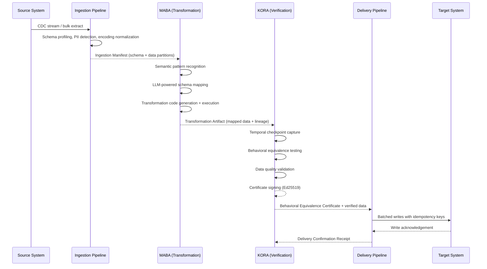

# Data Flow

## Data Path Through the Pipeline

This document describes the complete data flow from source system connection through transformation, verification, and delivery to the target system. Each stage is defined by its inputs, outputs, and the guarantees it provides to downstream consumers.

---

### Overview

A migration in Sensei proceeds through four principal phases: **Ingestion**, **Transformation**, **Verification**, and **Delivery**. Data flows through these phases as a directed pipeline, with well-defined checkpoints between each phase. No phase may begin until its predecessor has emitted a valid checkpoint artifact.

---

### Phase 1: Ingestion

The ingestion pipeline is responsible for extracting data from the source system and preparing it for transformation. Ingestion is performed by Scout agents (Layer 1) coordinating with Worker agents (Layer 2).

**Stages:**

1. **Connection establishment.** The platform authenticates to the source system using credentials retrieved from the secrets vault. Connection parameters (pool size, timeout, SSL mode) are resolved from the migration configuration. All source connections are read-only.

2. **Schema discovery.** Scout agents enumerate tables, columns, data types, constraints, indexes, stored procedures, and triggers. The discovered schema is encoded as a structured JSON document and persisted to the metadata database.

3. **Data profiling.** For each table, the pipeline samples a configurable number of rows (default: 10,000) and computes statistical profiles: cardinality, null ratio, value distributions, min/max ranges, and format patterns. Profiling results inform both transformation logic and verification thresholds.

4. **PII detection.** A classification model (fine-tuned BERT) scans column names, sample values, and contextual metadata to flag columns likely to contain personally identifiable information. Flagged columns are tagged in the schema document and subject to additional handling rules during transformation.

5. **Encoding normalization.** Source data is normalized to UTF-8. The pipeline detects source encoding with a confidence threshold (default: 0.9) and rejects ambiguous files for manual review rather than guessing.

6. **Partitioning.** The ingested dataset is divided into partitions based on table boundaries, row count thresholds, or custom partition keys. Each partition is written as a Parquet file to staging storage (S3) and registered in the Ingestion Manifest.

**Output:** The Ingestion Manifest -- a JSON document listing all discovered schemas, profiling results, PII flags, and references to staged data partitions. The manifest is published to the `ingestion.complete` Kafka topic.

---

### Phase 2: Transformation (MABA)

MABA consumes the Ingestion Manifest and produces transformed data mapped to the target schema. Transformation is performed by Architect agents (Layer 1) for planning and Worker agents (Layer 2) for execution.

**Stages:**

1. **Semantic pattern recognition.** Architect agents analyze the source schema and target schema simultaneously, using LLM-powered reasoning to identify semantic correspondences that go beyond name matching. A column named `cust_dob` in the source may map to `customer.date_of_birth` in the target; MABA resolves this through contextual analysis of surrounding columns, data types, and sample values.

2. **Schema mapping generation.** For each source entity, MABA generates a mapping specification that defines column-level transformations, type conversions, default values, and derived columns. Each mapping carries a confidence score. Mappings below the auto-approval threshold (default: 0.92) are routed to the AMANI interface for human review.

3. **Transformation code generation.** Approved mappings are compiled into executable transformation code (SQL and Python). The generated code is deterministic: given identical inputs, it produces identical outputs. Generated code is version-controlled and linked to the migration's audit trail.

4. **Transformation execution.** Worker agents execute transformation code against each data partition in parallel. Execution is distributed across the Ray compute cluster with configurable parallelism. Each worker processes one partition at a time, writes output to a target staging area, and emits a partition-level completion event.

5. **Lineage tracking.** Every transformation operation is recorded in a lineage graph: source column, transformation function, and target column. The lineage graph is persisted to Neo4j and referenced by KORA during verification.

**Output:** The Transformation Artifact -- a bundle containing transformed data partitions (Parquet), the mapping specification, generated transformation code, and the lineage graph. The artifact is published to the `transformation.complete` Kafka topic.

---

### Phase 3: Verification (KORA)

KORA consumes the Transformation Artifact and produces a Behavioral Equivalence Certificate attesting that the transformed data is semantically equivalent to the source data. Verification is performed by the Rust-based kora-core engine with Validator agents (Layer 2) orchestrating the process.

**Stages:**

1. **Temporal checkpoint capture.** KORA captures point-in-time snapshots of both source and transformed data at configurable intervals. These checkpoints enable "time-travel testing" -- replaying historical queries against both datasets to verify behavioral equivalence across the temporal dimension.

2. **Behavioral equivalence testing.** KORA replays a suite of queries (up to 1,000 per checkpoint, configurable) against source and target snapshots. Query results are compared using type-aware comparison with configurable tolerances: numeric epsilon (default: 0.0001), timestamp tolerance (default: 1s), and string normalization mode (exact, normalized, or semantic).

3. **Data quality validation.** Beyond equivalence, KORA validates data quality constraints: referential integrity, uniqueness constraints, not-null constraints, range checks, and custom business rules defined in the migration configuration. Validation rules are expressed in a Great Expectations-compatible format.

4. **Statistical validation.** KORA compares aggregate statistical properties of source and target datasets: row counts, column-level distributions, and summary statistics. Deviations beyond configured thresholds trigger a validation failure.

5. **Certificate generation.** If all verification checks pass, KORA generates a Behavioral Equivalence Certificate. The certificate includes: migration identifier, timestamp, verification method, summary of checks performed, evidence hashes, and a digital signature (Ed25519) computed over the certificate payload. The certificate is immutable once signed.

6. **Inconclusive handling.** If any check produces an ambiguous result, the certificate is issued with status INCONCLUSIVE and the migration is halted pending human review. KORA does not issue partial certificates.

**Output:** The Behavioral Equivalence Certificate and the verified data partitions. The certificate is published to the `verification.complete` Kafka topic. Verified data is promoted from staging to the delivery queue.

---

### Phase 4: Delivery

The delivery pipeline writes verified data to the target system. Delivery is performed by Worker agents with delivery-specific configuration.

**Stages:**

1. **Target connection establishment.** The pipeline authenticates to the target system using scoped credentials with write access to the designated target schema only. Connection pooling and retry parameters are resolved from the migration configuration.

2. **Batched writes.** Data is written to the target in configurable batches (default: 10,000 rows). Each batch carries an idempotency key derived from the partition identifier and batch sequence number. If a write is retried due to a transient failure, the idempotency key prevents duplicate insertion.

3. **Write acknowledgement.** The target system acknowledges each batch. The delivery pipeline records the acknowledgement, including row count, elapsed time, and any warnings emitted by the target.

4. **Delivery confirmation.** Once all partitions have been written and acknowledged, the delivery pipeline generates a Delivery Confirmation Receipt. The receipt references the Behavioral Equivalence Certificate and includes aggregate delivery metrics: total rows written, total elapsed time, and a checksum of the delivered data.

5. **Post-delivery validation.** An optional final validation pass runs a configurable set of queries against the target system to confirm that the delivered data is queryable and consistent. This step catches issues introduced by the target system's own write pipeline (e.g., trigger side effects, materialized view refresh delays).

**Output:** The Delivery Confirmation Receipt, published to the `delivery.complete` Kafka topic and persisted to the audit log.

---

### Kafka Topic Architecture

The pipeline uses Kafka as the inter-phase communication backbone. Each phase transition is represented by a dedicated topic:

| Topic                     | Producer           | Consumer             | Payload                                 |
| ------------------------- | ------------------ | -------------------- | --------------------------------------- |
| `ingestion.complete`      | Ingestion Pipeline | MABA                 | Ingestion Manifest                      |
| `transformation.complete` | MABA               | KORA                 | Transformation Artifact reference       |
| `verification.complete`   | KORA               | Delivery Pipeline    | Certificate + verified data reference   |
| `delivery.complete`       | Delivery Pipeline  | Audit Service, AMANI | Delivery Confirmation Receipt           |
| `migration.events`        | All phases         | Orchestrator, AMANI  | Progress events, errors, status changes |
| `agent.coordination`      | Orchestrator       | All agents           | Work assignments, configuration updates |

All topics are configured with a replication factor of 3 and a minimum in-sync replica count of 2. Messages are retained for the duration of the migration plus a configurable grace period (default: 7 days).

---

### Error Handling and Retry Semantics

Each phase implements idempotent processing. If a worker fails mid-partition, the partition is reassigned to another worker, which reprocesses it from the beginning. Partial outputs from the failed worker are discarded; the idempotency key ensures no duplicate data reaches the target.

Transient errors (network timeouts, connection resets) are retried with exponential backoff. Permanent errors (authentication failures, schema violations) are recorded and escalated to the orchestrator, which may halt the migration or route the error to AMANI for human intervention.

The pipeline guarantees **at-least-once delivery** at the partition level and **exactly-once semantics** at the row level through idempotency keys.

---

### Data Residency and Sovereignty

At no point does migration data leave the deployment region unless explicitly configured for cross-region replication. All staging storage, intermediate artifacts, and Kafka topics reside within the same cloud region as the compute infrastructure. For air-gapped deployments, all data remains within the customer's network boundary.

> [Technology Stack Overview](README.md) > [High Availability](high-availability.md) > [Security Architecture](security-architecture.md)
