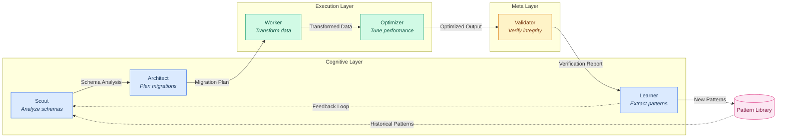

## Multi-Agent Cognitive Architecture

Sensei uses a three-layer agent architecture. The Cognitive layer reasons about schemas and plans migrations. The Execution layer carries out transformations and performance tuning. The Meta layer validates results and feeds learned patterns back into the Cognitive layer, creating a self-improving loop.

