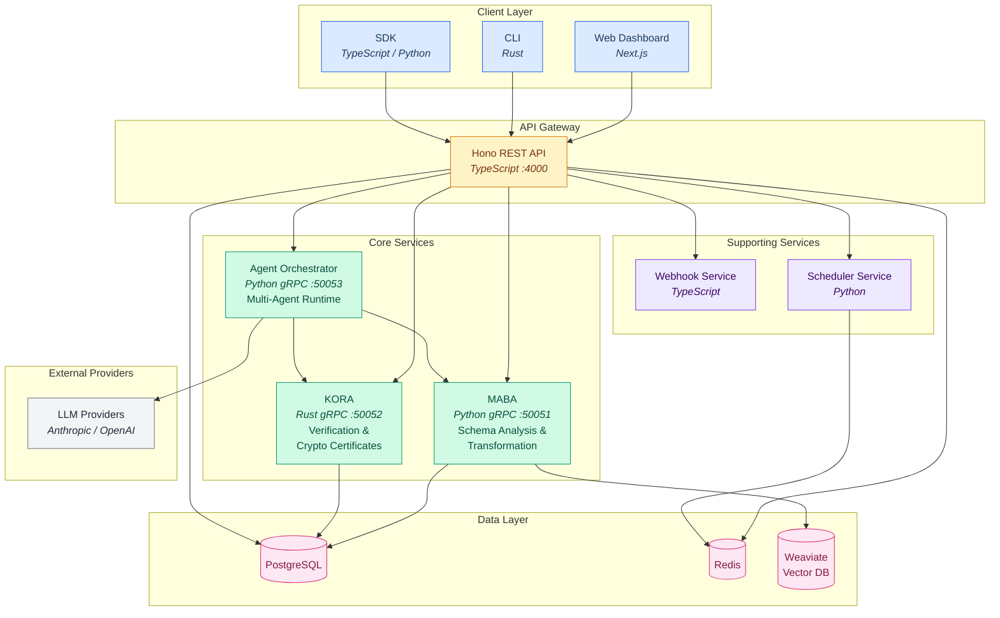

## System Architecture

High-level view of the Sensei platform, organized into five layers: client interfaces, the API gateway, core gRPC services, supporting microservices, and the data/external layer. Arrows indicate the primary communication paths between components.

