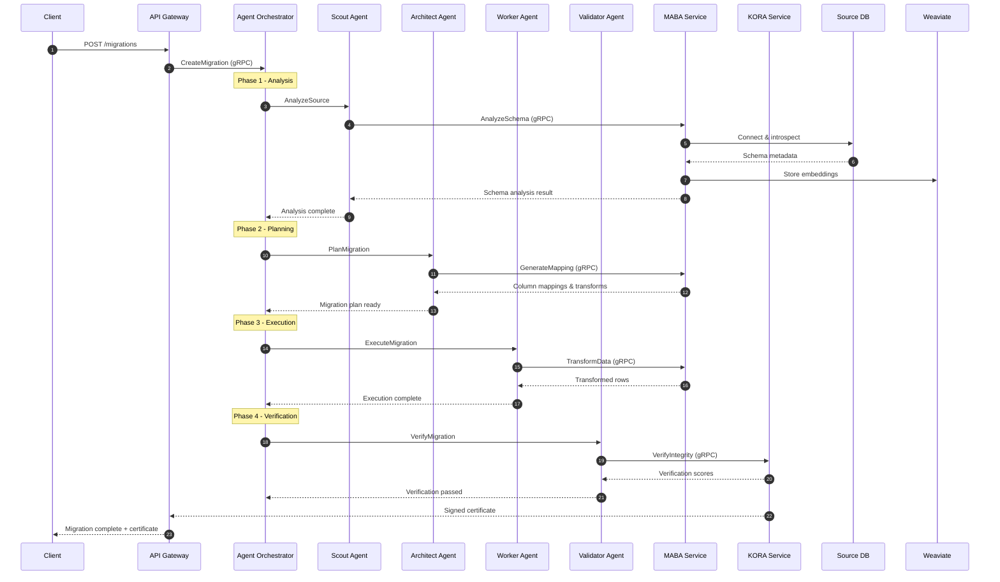

## Migration Data Flow

End-to-end sequence for a single migration request, from the initial API call through agent orchestration, schema analysis, data transformation, cryptographic verification, and final delivery of the migration certificate back to the client.

