## CI/CD Pipeline

The Sensei CI/CD pipeline begins with change detection on pull requests, routing work into language-specific build tracks (TypeScript, Python, Rust, Protobuf). All tracks converge on integration tests backed by Postgres and Redis service containers, followed by a Trivy security scan. Merges to main trigger Docker image builds, and version tags drive Helm-based deployment through staging and production.

```mermaid
flowchart LR

    subgraph Trigger["Trigger"]
        PR[PR Opened /<br/>Push to main]
    end

    subgraph Detect["Change Detection"]
        CHANGES{Changes<br/>Detected}
    end

    subgraph CI["CI Phase"]
        direction TB

        subgraph TS["TypeScript Track"]
            TS_INSTALL[pnpm install] --> TS_LINT[ESLint]
            TS_LINT --> TS_TYPE[tsc --noEmit]
            TS_TYPE --> TS_TEST[Vitest]
            TS_TEST --> TS_BUILD[Turborepo build]
        end

        subgraph PY["Python Track"]
            PY_INSTALL[uv sync] --> PY_LINT[Ruff]
            PY_LINT --> PY_TYPE[mypy]
            PY_TYPE --> PY_TEST[pytest]
            PY_TEST --> PY_COV[Coverage]
        end

        subgraph RS["Rust Track"]
            RS_BUILD[cargo build] --> RS_LINT[clippy]
            RS_LINT --> RS_TEST[cargo test]
            RS_TEST --> RS_COV[llvm-cov]
        end

        subgraph PROTO["Proto Track"]
            BUF_LINT[buf lint] --> BUF_BREAK[buf breaking]
            BUF_BREAK --> CODEGEN[Code generation]
        end
    end

    subgraph Integration["Integration & Security"]
        INT_TEST[Integration Tests<br/><i>Postgres + Redis</i>]
        SECURITY[Security Scan<br/><i>Trivy</i>]
    end

    subgraph CD["CD Phase"]
        DOCKER[Docker Build<br/>& Push to Registry]
        HELM[Helm Deploy]
        STAGING[Staging<br/>Environment]
        PROD[Production<br/>Environment]
    end

    PR --> CHANGES
    CHANGES -- "TypeScript" --> TS_INSTALL
    CHANGES -- "Python" --> PY_INSTALL
    CHANGES -- "Rust" --> RS_BUILD
    CHANGES -- "Proto" --> BUF_LINT

    TS_BUILD --> INT_TEST
    PY_COV --> INT_TEST
    RS_COV --> INT_TEST
    CODEGEN --> INT_TEST

    INT_TEST --> SECURITY
    SECURITY -- "Merge to main" --> DOCKER
    DOCKER -- "Tag v*" --> HELM
    HELM --> STAGING
    STAGING --> PROD

    classDef trigger fill:#f3f4f6,stroke:#6b7280,color:#1f2937
    classDef detect fill:#fef3c7,stroke:#d97706,color:#78350f
    classDef ts fill:#dbeafe,stroke:#2563eb,color:#1e3a5f
    classDef py fill:#d1fae5,stroke:#059669,color:#064e3b
    classDef rs fill:#fee2e2,stroke:#dc2626,color:#7f1d1d
    classDef proto fill:#ede9fe,stroke:#7c3aed,color:#3b0764
    classDef integ fill:#fce7f3,stroke:#db2777,color:#831843
    classDef cd fill:#cffafe,stroke:#0891b2,color:#164e63

    class PR trigger
    class CHANGES detect
    class TS_INSTALL,TS_LINT,TS_TYPE,TS_TEST,TS_BUILD ts
    class PY_INSTALL,PY_LINT,PY_TYPE,PY_TEST,PY_COV py
    class RS_BUILD,RS_LINT,RS_TEST,RS_COV rs
    class BUF_LINT,BUF_BREAK,CODEGEN proto
    class INT_TEST,SECURITY integ
    class DOCKER,HELM,STAGING,PROD cd
```

