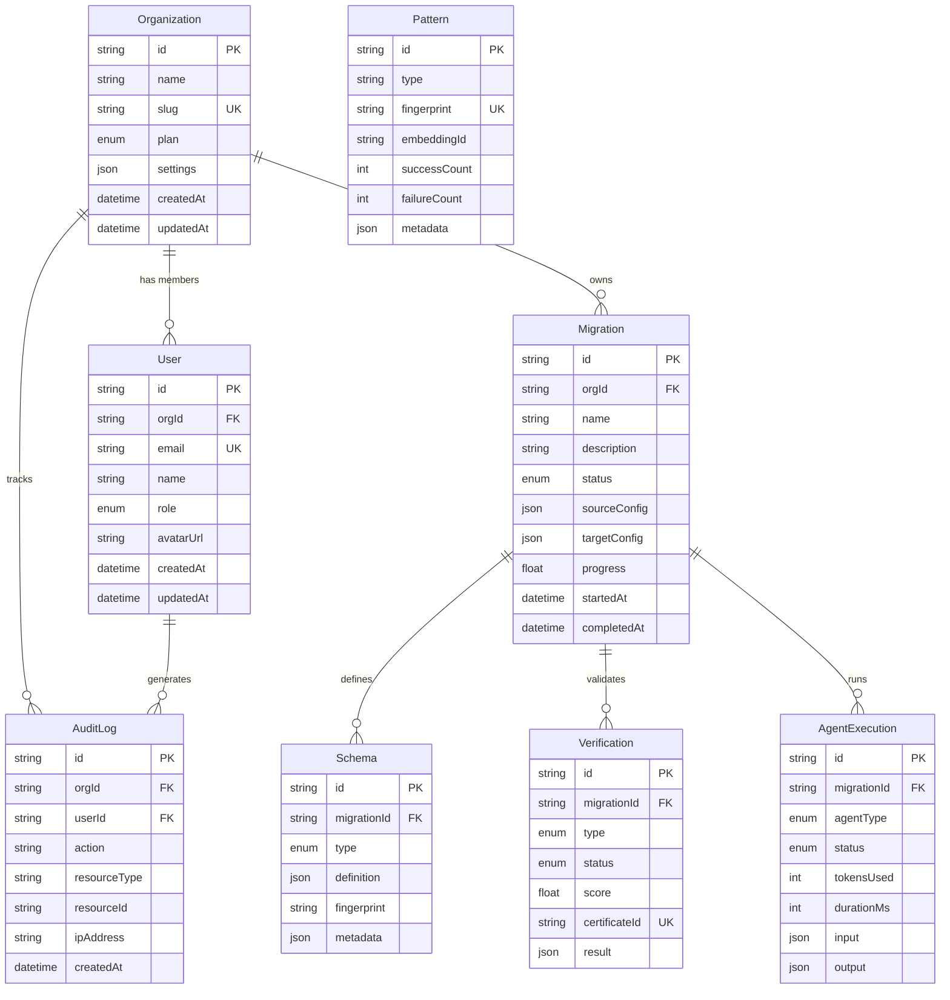

## Database Entity Relationship Diagram

The Sensei platform persists eight Prisma models in PostgreSQL. An Organization owns Users, Migrations, and AuditLogs. Each Migration tracks its Schemas, Verifications (with cryptographic certificates), and AgentExecutions. The Pattern model is standalone and stores learned migration patterns with Weaviate embedding references.

