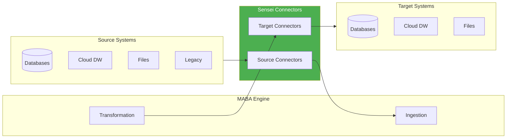

# Connectors

## Universal Data Connectivity

Sensei connects to virtually any data source or target through its extensive connector library. Each connector is optimized for the specific characteristics of its system type.

---

## Connector Architecture



---

## Database Connectors

### Relational Databases

| Database       | Read | Write | CDC | Notes               |
| -------------- | ---- | ----- | --- | ------------------- |
| **PostgreSQL** | Yes  | Yes   | Yes | 9.6+ supported      |
| **MySQL**      | Yes  | Yes   | Yes | 5.7+, MariaDB 10.2+ |
| **Oracle**     | Yes  | Yes   | Yes | 11g+, requires JDBC |
| **SQL Server** | Yes  | Yes   | Yes | 2014+, Azure SQL    |
| **SQLite**     | Yes  | Yes   | —   | Embedded databases  |
| **IBM DB2**    | Yes  | Yes   | Yes | LUW and z/OS        |
| **SAP HANA**   | Yes  | Yes   | Yes | Requires SAP client |
| **Sybase ASE** | Yes  | Yes   | —   | 15.7+               |

#### PostgreSQL Connector

```yaml
connection:
  type: postgresql
  host: db.example.com
  port: 5432
  database: production
  username: ${POSTGRES_USER}
  password: ${POSTGRES_PASSWORD}
  ssl_mode: require

options:
  parallel_readers: 8
  batch_size: 10000
  use_copy: true # Fast bulk operations
```

**Capabilities:**

- Parallel table scanning with configurable thread count
- Native COPY protocol for maximum throughput
- Logical replication for CDC
- Schema extraction including constraints, indexes, and comments

→ [PostgreSQL Reference](source-connectors.md#postgresql)

---

### Cloud Data Warehouses

| Platform          | Read | Write | CDC | Notes                    |
| ----------------- | ---- | ----- | --- | ------------------------ |
| **Snowflake**     | Yes  | Yes   | Yes | All regions              |
| **BigQuery**      | Yes  | Yes   | —   | Standard and partitioned |
| **Redshift**      | Yes  | Yes   | —   | RA3 and Serverless       |
| **Databricks**    | Yes  | Yes   | Yes | Unity Catalog support    |
| **Azure Synapse** | Yes  | Yes   | —   | Dedicated and Serverless |
| **ClickHouse**    | Yes  | Yes   | —   | Cloud and self-hosted    |

#### Snowflake Connector

```yaml
connection:
  type: snowflake
  account: xy12345.us-east-1
  warehouse: MIGRATION_WH
  database: PRODUCTION
  schema: PUBLIC
  username: ${SNOWFLAKE_USER}
  private_key_path: /path/to/rsa_key.p8

options:
  use_internal_stage: true
  parallel_uploads: 4
  compression: AUTO
```

**Capabilities:**

- Stage-based bulk loading for maximum throughput
- Key-pair authentication (no password in logs)
- Cross-cloud replication support
- Time-travel queries for validation

→ [Snowflake Reference](target-connectors.md#snowflake)

---

### Document Databases

| Database              | Read | Write | CDC | Notes                 |
| --------------------- | ---- | ----- | --- | --------------------- |
| **MongoDB**           | Yes  | Yes   | Yes | 4.4+, Atlas supported |
| **Elasticsearch**     | Yes  | Yes   | —   | 7.x and 8.x           |
| **CouchDB**           | Yes  | Yes   | Yes | Changes feed          |
| **Amazon DocumentDB** | Yes  | Yes   | Yes | MongoDB compatible    |

#### MongoDB Connector

```yaml
connection:
  type: mongodb
  uri: mongodb+srv://cluster.mongodb.net
  database: production

options:
  flatten_documents: true
  max_depth: 5
  array_handling: expand # or: first_element, json_string
```

**Capabilities:**

- Schema inference from sample documents
- Nested document flattening with configurable depth
- Array expansion or preservation
- Change stream support for CDC

---

## File Connectors

### Structured Files

| Format         | Read | Write | Notes                           |
| -------------- | ---- | ----- | ------------------------------- |
| **CSV**        | Yes  | Yes   | Auto-detect delimiter, encoding |
| **TSV**        | Yes  | Yes   | Tab-separated values            |
| **JSON**       | Yes  | Yes   | JSON Lines and nested           |
| **JSON Lines** | Yes  | Yes   | Streaming format                |
| **Parquet**    | Yes  | Yes   | Columnar, schema embedded       |
| **Avro**       | Yes  | Yes   | Schema registry support         |
| **ORC**        | Yes  | Yes   | Hive optimized                  |

#### CSV Connector

```yaml
connection:
  type: csv
  path: s3://bucket/data/*.csv

options:
  delimiter: auto # or: comma, tab, pipe, semicolon
  encoding: auto # or: utf-8, latin-1, cp1252
  header: true
  quote_char: '"'
  escape_char: '\\'
  null_values: ['', 'NULL', 'N/A']
  date_formats: ['%Y-%m-%d', '%m/%d/%Y', '%d-%b-%Y']
```

**Capabilities:**

- Automatic delimiter and encoding detection
- Multi-file glob patterns
- Date format inference
- Malformed row handling (skip, fail, quarantine)

---

### Document Files

| Format            | Read | Notes                     |
| ----------------- | ---- | ------------------------- |
| **Excel (.xlsx)** | Yes  | Multi-sheet support       |
| **Excel (.xls)**  | Yes  | Legacy format             |
| **Google Sheets** | Yes  | API integration           |
| **PDF**           | Yes  | Table extraction with OCR |
| **Word (.docx)**  | Yes  | Table extraction          |

#### Excel Connector

```yaml
connection:
  type: excel
  path: /data/workbooks/report.xlsx

options:
  sheets: ['Sheet1', 'Data'] # or: all
  header_row: 1
  data_start_row: 2
  skip_hidden_rows: true
  named_ranges: true
```

---

### Cloud Storage

| Platform                 | Supported |
| ------------------------ | --------- |
| **Amazon S3**            | Yes       |
| **Google Cloud Storage** | Yes       |
| **Azure Blob Storage**   | Yes       |
| **SFTP**                 | Yes       |
| **Local filesystem**     | Yes       |

```yaml
# S3 Example
connection:
  type: s3
  bucket: my-data-bucket
  prefix: exports/2024/
  region: us-east-1
  access_key: ${AWS_ACCESS_KEY}
  secret_key: ${AWS_SECRET_KEY}
```

---

## Legacy Connectors

### Mainframe Systems

| System                   | Read | Write | Notes                |
| ------------------------ | ---- | ----- | -------------------- |
| **IBM AS/400 (iSeries)** | Yes  | Yes   | DB2 for i            |
| **IBM Mainframe (z/OS)** | Yes  | Yes   | DB2 for z/OS, VSAM   |
| **COBOL Copybooks**      | Yes  | —     | Schema extraction    |
| **EBCDIC Files**         | Yes  | Yes   | Encoding translation |

#### COBOL Copybook Connector

```yaml
connection:
  type: cobol
  copybook_path: /schemas/CUSTOMER.cpy
  data_path: /data/CUSTMAST.DAT

options:
  encoding: EBCDIC
  record_format: fixed # or: variable
  packed_decimal: true
  convert_to: utf-8
```

**Capabilities:**

- Full COBOL copybook parsing (COMP, COMP-3, etc.)
- EBCDIC to UTF-8 conversion
- Packed decimal handling
- REDEFINES support

→ [Mainframe Migration Guide](../../enterprise/resources/best-practices/tutorials/README.md)

---

### Legacy Databases

| Database              | Read | Write | Notes                |
| --------------------- | ---- | ----- | -------------------- |
| **Informix**          | Yes  | Yes   | 11.5+                |
| **Teradata**          | Yes  | Yes   | Parallel transporter |
| **Progress OpenEdge** | Yes  | —     | ODBC bridge          |
| **FoxPro/dBASE**      | Yes  | —     | DBF files            |

---

## Connector Development

### Custom Connectors

Need a connector we don't have? Options:

1. **Request it:** Submit via feature request — popular requests prioritized
2. **JDBC/ODBC bridge:** Connect any JDBC or ODBC source
3. **Generic file:** Export to CSV/JSON and use file connectors
4. **Custom development:** Enterprise tier includes custom connector development

### JDBC Generic Connector

```yaml
connection:
  type: jdbc
  driver_class: com.vendor.jdbc.Driver
  driver_path: /drivers/vendor-jdbc.jar
  connection_url: jdbc:vendor://host:port/database
  username: ${DB_USER}
  password: ${DB_PASSWORD}

options:
  fetch_size: 5000
  isolation_level: READ_COMMITTED
```

---

## Connector Performance

### Throughput Benchmarks

| Connector  | Read (rec/sec) | Write (rec/sec) | Notes              |
| ---------- | -------------- | --------------- | ------------------ |
| PostgreSQL | 150,000        | 100,000         | COPY protocol      |
| MySQL      | 120,000        | 80,000          | LOAD DATA          |
| Snowflake  | 200,000        | 180,000         | Internal stage     |
| BigQuery   | 180,000        | 150,000         | Streaming insert   |
| S3 Parquet | 500,000        | 400,000         | Parallel multipart |
| MongoDB    | 80,000         | 60,000          | Bulk operations    |

_Benchmarks on 4-node Ray cluster, 32 cores per node, 10Gbps network_

---

## Connection Security

All connectors support:

- **Encryption in transit:** TLS 1.2+ required
- **Credential management:** Environment variables, secrets managers
- **Network security:** VPC peering, private endpoints, IP allowlisting
- **Authentication:** Password, key-pair, OAuth, IAM roles

```yaml
# AWS Secrets Manager integration
connection:
  type: postgresql
  credentials:
    provider: aws_secrets_manager
    secret_name: prod/postgres/migration
    region: us-east-1
```

→ [Security Architecture](../architecture/technology-stack/security-architecture.md)
→ [Source Connectors Reference](source-connectors.md)
→ [Target Connectors Reference](target-connectors.md)
